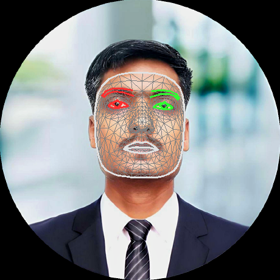

# AI-Computer Vision
This repo contains my "Computer Vision &amp; AI" related projects.

## Hands Landmarks Detection
This project capture the video using webcam and then performs hands detection and hands key points detection. It finally provides the recognition video of hand landmarks of the detected hands.
 
<video src="https://github.com/user-attachments/assets/6bb51343-7363-48f1-b39c-dfc718993f65" autoplay loop></video>

## Hands Gesture Detection
This project performs hands guesture recognition in real time on a pretrained model. The output can be used to recognize specific hand gestures from a user, and invoke application features that correspond to those gestures.
 

|Input Video|Hand Gesture Detection|
|----|----|
|||

## Face Detection
This project performs face detection in real time using mediapipe framework. The output can be used to detect human faces and count number of human faces in the frame, and it can be used in various applications.
 

|Input Image|Face Detection with 6 Keypoints|
|----|----|
|||

|Input Video|Face Detection Output|
|----|----|
| | |

## Face Landmarks Detection
This project performs face landmarks detection in real time using mediapipe framework. The output can be used to recognize a user, and can be used in various applications like to identify human facial expressions and apply facial filters and effects to create a virtual avatar.

|Input Image|478 Face Landmarks Detection|
|----|----|
|||

|Input Video|478 Face Landmarks Detection|
|----|----|
|||

## Face Stylization (Filters)
This project performs face stylization using mediapipe framework. The output can be used to cretate styles photo, and can be used in various applications like to create artistic photo and apply facial filters and effects to create a virtual avatar.
 
|Input Image|Face Filter 1|Face Filter 2|Face Filter 3|
|----|----|----|----|
|||||

### Pose Landmarks Detection
This project performs pose landmarks detection in real time using mediapipe framework. The output can be can be used in various applications like to identify key body locations, analyze posture, and categorize movements.
 
|Input Image|33 Pose Landmarks Detection|
|----|----|
|||

### Holistic Landmarks Detection
This project performs pose, face and hands landmarks detection in real time using mediapipe framework. The output can be can be used in various applications like to identify key body locations, analyze posture, and categorize movements.
 
<video src="https://github.com/user-attachments/assets/d3cb8acc-587d-4ee9-af36-1fbcc922f06f" autoplay loop></video>

### Objects Detection
This project performs object detection in real time using mediapipe framework. The output can be can be used in various applications like to identify objects and locate objects or count number of objects in the scene.
 
|Input Image|Objects Detected|
|----|----|
|||

